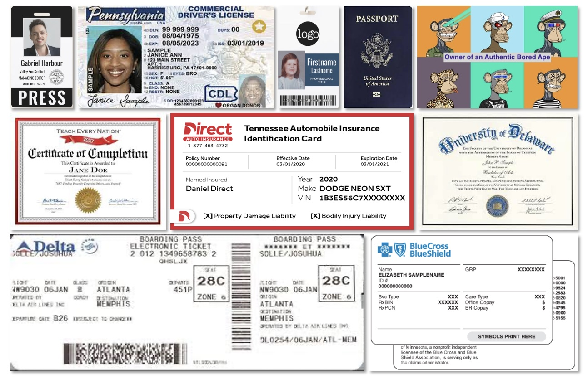
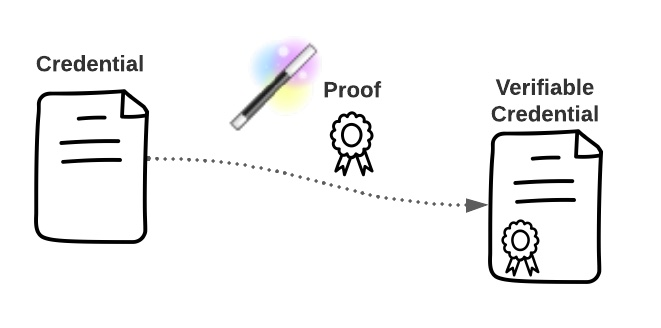
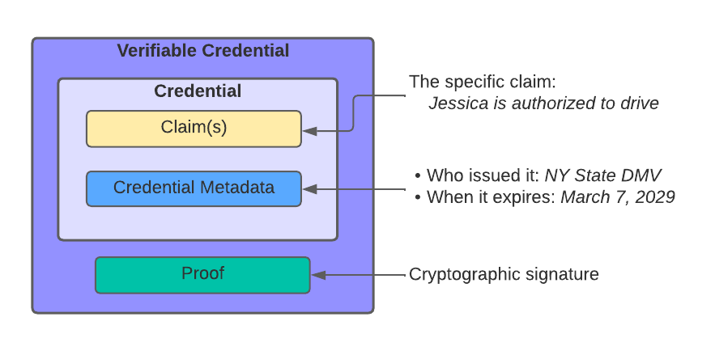
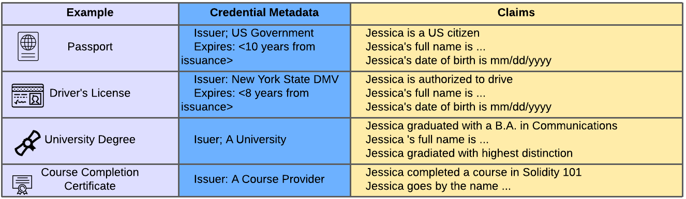
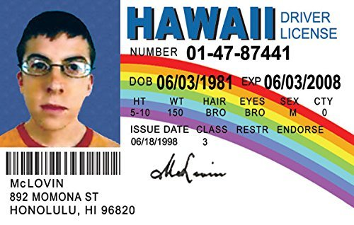
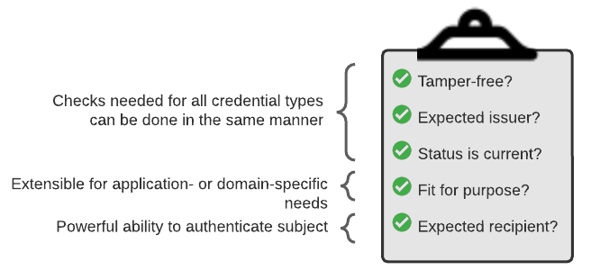

This post aims to provide an extremely informal, no-background-needed introduction to a fundamental[[^1]] decentralized identity concept -- the Verifiable Credential (VC) -- through pictures, metaphors, and dated pop-cultural references. 

The term "Verifiable Credential" is formally defined in the [W3C Verifiable Credential](https://www.w3.org/TR/vc-data-model/) specification enabling portable, individual-managed identity claims, but you're not here to read a spec -- you want some light, if not entertaining, reading, so let's sidle on up to VCs through real-world comparisons.

Blogs shouldn't need tables of content, but here we are...

**Table of contents**

- [Context](#context)
- [Terms and concepts](#terms-and-concepts)
- [How this maps to your real-world credentials](#how-this-maps-to-your-real-world-credentials)
- [How are your real-world credentials verified today? 😕](#how-are-your-real-world-credentials-verified-today-)
- [Why credential verification is so hard](#why-credential-verification-is-so-hard)
- [Quick takeaways and more grandstanding](#quick-takeaways-and-more-grandstanding)
- [Verifiable Credential verification 🎉](#verifiable-credential-verification-)
- [The VC value proposition, summarized](#the-vc-value-proposition-summarized)
- [End Notes](#end-notes)

## Context

It's easiest to think about VCs in relation to cards, badges, and documents you already use to establish aspects of your identity: your age, where you live, your skills, accomplishments, and privileges -- your..."credentials". Many of these are in physical form, and allow you to gain access to a location or to information.

Some examples, all of which may be represented by VCs in _digital_ form are:
- Driver's licenses
- Passports
- Student or employee ID cards
- Airline tickets
- Insurance cards, such as medical or auto
- Learning records, including
  - formal ones, like diplomas or transcripts
  - informal ones, like completion of a course
- Proof of purchase or participation in a community[[^2]]

Just as you carry your (physical) driver's license or ID card in a (physical) wallet, wristlet, belt bag, disco backpack, or other personal carry-all, you can carry VCs around with you in a _digital_ wallet or carry-all.[[^3]]

### How is this different?
On the surface, this doesn't sound innovative and you may ask: haven't we solved this already? There are already digital versions of many of the above examples plus wallet apps to store them; isn't it just a matter of time before all are addressed? Well, *sort of*, but VCs solve a lot of problems lurking right around the corner.

A quick way to visualize one such problem is with this question: Do you carry around multiple physical wallets? One to store your auto insurance card, another to store your driver's license? Of course not. However, many of your digital wallets were designed with specific data in mind, leading to a many-digital-wallet outcome that will only get harder to manage over time[[^4]]. And there are many other limitations that VCs address, such as lockin and dependencies on service providers, but let's start with the basics.

## Terms and concepts

The [W3C Verifiable Credential Data Model](https://www.w3.org/TR/vc-data-model/) defines a "Credential" and a "Verifiable Credential", which are related as follows:

Take a Credential, add a "proof" -- a cryptographic seal -- and *poof* you get a Verifiable Credential

We need to go one layer deeper to define the contents of a Credential, but that will be all the formalism we need for now.

A _Credential_ is a set of one of more _Claims_ with associated _Credential Metadata_:

- a _Claim_ is an assertion (or statement) made about a _subject_, which you can assume is a person for purposes of this post.
  - Example claim: Jessica (subject) is authorized to drive (assertion)
- _Credential Metadata_ refers to metadata in the usual sense: info about the credential itself, like the issuance and expiration dates, who the issuer is, etc
  - Example credential metadata for Jessica's driver's license:
    - Issuer: NY state DMV
    - When issued: March 7, 2022
    - Expires: March 7, 2029

> Please forgive the overused driver's license example -- this is only to ground these definitions in (highly likely) familiar real-world credentials, although I've introduced US-specific quirks in the "use and verification" section.[[^5]] You'll soon see that there are VC use cases that are _far_ more interesting than driver's licenses.

## How this maps to your real-world credentials

Before spending time on the "verifiable" (proof) part, it's worth elaborating the credential part, to see how this maps to identity credentials in the wild.

Example: Jessica's college diploma -- she has a B.A. in Communications from a university we'll call "A University":
- Claim: Jessica (subject) has a B.A. in Communications (assertion)
- Metadata:
  - Issuer: A University
  - When issued: May 29, 2016
  - Expires: N/A; it should be valid for life[[^6]]

But wait, Jessica's diploma has another claim in addition to "has a B.A. in Communications" --  it also says she graduated summa cum laude (with highest distinction)...and it has her full legal name:

> If it's not obvious by now, I've changed almost all real-world details about Jessica to protect her privacy. In fact, I used an elf name generator

In general, many of your real-world credentials contain multiple claims -- full name, date of birth, residence, etc. In addition to enabling access to locations and services based on identity attributes (e.g., proving you're over the age of 25 to rent a car), these can be used to corroborate, or reliably enhance, other identity credentials[[^7]]. 

The following table breaks down a few more real-world credential examples to demonstrate the similar structure and metadata. 

All of this is to belabor the point: the VC data model was developed with many real-world credentials in mind, and takes advantage of common structure and metadata, such as:
- Issuer: who said it
- Issuance date: when it was issued
- Expiration date: when it expires

As well as more dynamic properties, such as status. In other words, how do you determine if the credential is still valid? How do you know the issuer hasn't revoked it? And this segues nicely to the verifiable part in the next section.

One benefit of VCs should already be clear: its common data structure makes it easy to read and extract key metadata, simplifying the proposition for "universal" digital identity wallets (or other applications that store and manage credentials), as well as consumers of the credentials, such as individuals or organizations you choose to share your credentials with.

## How are your real-world credentials verified today? 😕

Let's move to why and how you _use_ your real-world credentials in the wild. Very loosely, you use them to prove aspects of who you are, your skills/accomplishments, or to perform a range of activities -- enter a location, open a bank account. When required, you share your credentials with a "verifier", who will determine if the credential is acceptable, or "verify" it. 

With physical credentials, and even with many digital credentials in use, _how_ verification occurs can be extremely complicated. So complicated, in fact, that your real-world credentials may be considered too much work to actually verify, as you'll see in the next sections. 

Fraud abounds, capable but under-recognized talent gets overlooked, and everybody loses. And this is the heart of the enormous advantange of VCs, the "verifiable" part.

### Case studies

Before talking about how clean VC verification is, let's get a taste for the extraordinarily weird world of verifying your current real-world credentials.

#### Case study 1: Driver's license

Pretend you work at a convenient store, where you assume the role of "verifier" of driver's licenses before allowing people to purchase alcohol. Think about whether you'd accept McLOVIN's driver's license. 

You'd be fairly lucky to be handed a forgery this obvious. Some details clue you in to the fact that this _may_ be fraudulent: the single name is not something you've seen before, and the age doesn't appear to match the person standing in front of you. But you, trained verifier, are aware of other nuances confirming your hunch that this is not an _authentic_ id. Perhaps the weight of the card feels flimsy, a watermark or state flag is missing, and so on.  

But wait, this is just one U.S. state's driver's license. Do you, the verifier, need to memorize the structure and details of all other state driver's licenses (in addition to U.S. passports, as well as international ID documents...)? This is clearly not feasible, so do you pay for a service or outsource the problem?

The level of diligence required depends on the exact use case, and corresponds to the stakes or penalties for the verifier getting it wrong. Fortunately for this discussion, US driver's licenses -- the strange standard bearer of our identity in the U.S. -- have well-documented requirements[[^8]]. Let's explore some different contexts for how Jessica will use her New York state driver's license, loosely ordered from what we'll call "low" to "high" stakes, corresponding to the level of diligence that will be applied.

> For our non-US friends wondering why identity cards are linked to the ability/privilege to drive, note that state DMVs can also issue non-driving "ID cards". And we do have passports. 

Example uses of driver's licenses:

- **Use Case 1**: Jessica proves her age to purchase alcohol
  - **Why verification is needed**: Federal and state laws preventing sales of alcohol to minors
  - **How verification occurs**: Bartender or sales clerk, who has received training, inspects Jessica's ID to ensure it's current, doesn't look fake, and that the photo looks like Jessica, who is standing in front of them.
    - **Gory details**: 
      - An inspection includes checking the expiration date, date of birth, photo match, and ID's unique features, which vary per state.[[^9]]
      - While the verifier in this case has an interest in performing their duties, they are not necessarily checking the _status_ of Jessica's credential -- i.e., the Verifier wouldn't necessarily know if Jessica's license was suspended.[[^10]]
      - This reflects that driving privileges are actually unrelated to the use of driver's licenses as ID cards. And in fact, other forms of ID are acceptable (like passports)
  - **What if the verifier does a bad job**: 
    - If the verifier (bartender or sales clerk) is found to be negligent in their check, they can be fired, sued (if someone is injured or dies), face a criminal charge or jail time. 
    - Also, the bar or store may be fined or lose their liquor license 
- **Use Case 2**: Jessica needs to provide identification to open a bank account online
  - **Why verification is needed**: Financial service providers have a vested interest in preventing fraud to protect the bottom line. Plus, they need to comply with a number of regulations.
  - **How verification occurs**: The bank probably pays a service to do the work. This involves having Jessica submit digital copies -- photos -- of her driver's license and other materials. They may also have her upload a selfie as a simulation of an in-person verifier's ability to check that the person standing in front of them looks like the photo in the ID.[[^11]]
    - **Gory details**:
      - As with Case 1, a driver's license isn't specifically needed, but it is commonly used in the US to fill the bank's requirement for a valid government-issued photo ID and other docs that confirm your name, date of birth, address, ID number (social security number of taxpayer ID number) as part of identity verification[[^12]]
      - Also as with Case 1, the bank needs to ensure it's not expired, but they probably don't care if Jessica's driver's license is revoked because she have a ton of unpaid parking tickets, so a status check may not be performed. That said, they do care if she's on a government sanctions list and will check her name and personal information against, e.g., the OFAC SDN list[[^13]]
  - **What if the verifier does a bad job**: Enormous fines and possible imprisonment[[^14]]
- **Use Case 3**: Police pull over Jessica and ask for her driver's license
  - **Why verification is needed**: Police wants to ensure Jessica is an authorized driver, and there's not a warrant out for her arrest
  - **How verification occurs**: Police "run" Jessica's license which directly checks a database that is up to date with state DMVs and also compare the photo
    - **Gory details**: Aha, someone finally cares if Jessica's driving privileges are revoked because this is their "wheelhouse" 🥁 and that is why they will check state DMV databases
  - **What if the verifier does a bad job**: I don't know? Unlike the above examples, this is one of their core law enforcement functions, and if the context is that you're already pulled over, you tend not to worry about them erring on the side of lenience. I imagine it really depends and could range from internal disciplinary action to criminal penalties. This topic is fraught...
- **Use Case 4**: Jessica presents her ID to TSA before boarding a domestic flight in the USA.
  - tl;dr: this is like Case 3. Although TSA doesn't care about your driving privileges, one of their core functions is ID verification to help ensure safe travel. TSA is not messing around with this, and they invest large amounts in specialized systems.

> From now on, we won't be as exhaustive, reflecting (1) that the previous section was overkill and (2) the fact that verifiers aren't as diligent anyway

#### Case study 2: College degree

**Use case**: Jessica applies for a job[[^15]]
- **Why verification is needed**: Employers want to make sure Jessica's claims about her education and work background are correct. In some cases, a background check may be part of their compliance program.
- **How verification occurs**: The risks and associated level of effort vary within different phases of the lifecycle
  - Recruiter: initially, they are screening Jessica as a sanity check. They may simply look at Jessica's resume and her LinkedIn, but probably won't request proof of her college degree
  - Employer: 
    - After Jessica passes the interview, but before extending an offer, they may validate Jessica's college degree (in addition to other aspects of her identity and experience)
    - If so, validating Jessica's claim requires contacting the college or a "clearinghouse", which is an aggregator across many institutions. The employer likely uses a service to perform this check as opposed to contacting the college/clearinghouse directly.
    - But...they may not, and college degree fraud is very common.
- **What if the verifier does a bad job**: 
  - Well, this also depends, and the stakes may be quite high if the employer is a regulated entity. i.e., they may be fined if they are a bank
  - But her college degree is not the key document here. If they're a regulated entity, they're actually doing a background check, for which her other ID documents (driver's license, etc) are most important
  - But otherwise, they're concerned with ensuring overall Jessica is qualified for the job and it's a loose calculus based on her work experience, etc.

#### Case study 3: Online course credentials (or, more generally, lifelong learning and skills)

Jessica is a lifelong learner and her college degree, though impressive, is one of the least interesting things about her. She's enhanced her skills beyond what's typical for a communications professional, and recently completed an online program in business administration and operations, for which she has a digital credential (as a PDF). She's now looking for a new opportunity for which these recently-added skills are needed.

**Use case**: Jessica uses her online course credentials as part of her application to a job with more responsibilities
- **Why verification is needed**: Employer wants to ensure she has the skills and qualifications she claims
- **How verification occurs**:
  - Recruiter: might just look on LinkedIn, but may not take educational credentials other than a traditional 4-year or above degree seriously. The recruiter will also factor in past job titles, but note that it's easy for someone to misrepresent job titles on their resume and LinkedIn. In sum, credentials establishing non-formal + informal learning and skills might not get her in the door for an interview.
  - Employer: If she's lucky, she gets through the recruiter and makes it to the employer interview, during which they'll try to assess her skills. The employer probably won't put much stock in her online learning credentials beyond their ability to paint a picture of Jessica as a motivated person.  The employer might contact her references as a sanity check.

## Why credential verification is so hard

What's going on here? Credentials representing your skills and accomplishments as an adult are largely ignored?

You don't need to feign surprise; you already know this to be true. But isn't it weird that credentials attesting to additional learning and skills credentials beyond some arbitrary point in time, maybe when you were a fairly naive early 20-ish person, are largely ignored? 

Pivoting to someone without a 4-year degree, the challenges are even more pronounced. A common scenario is this: a person begins a traditional educational program but has to stop a few credits short of, e.g., an Associate's Degree. Their education combined with work experience may make them more than qualified for a higher-paying role, but they can't get in the door if the potential employer has an arbitrary requirement for a 4-year degree (or otherwise, doesn't have a way of admitting non-traditional candidates).

This isn't to imply that non-traditional credentials are a panacea, or that they could completely remove the need for an interview, but they could help in the following ways:
1. Broaden the candidate pool to people who have evidence of skills needed to perform the responsibilities of a job
2. Enable a more focused interview. If you're a developer, imagine you had a "can code basic data structures and algorithms" credential. If everyone knows that means you can write a program that reverses a linked list (among other thongs), your interviewer could ask you more interesting and relevant questions.

The problem of discriminatory -- or gatekeeping -- credentials/requirements applies outside of learning and employment scenarios; we see gatekeeping preventing access to financial products and services, and more. Many of us working on decentralized identity share a passion for unlocking new opportunities by establishing ways for people to prove a much broader range of information about themselves. Continuing in the area of financial products and services, perhaps one day proving reliable payment history could replace the requirement for a certain credit score from one of the "big 3" agencies. 

So why is verifying anything other than "high stakes" credentials so challenging?

### Reason 1: How to know it's valid?

First, there aren't well-established norms around verifying, or determining whether to accept, such a document -- specifically ensuring it hasn't been tampered with and is authentic.

If it's a signed PDF, at least the recipient can determine it's not been tampered with in their PDF reader -- BUT, it may be hard for them to determine whether it's issued by the party they expect. How do they know it was Wharton and not some imposter Whart0n? There are solutions, but they vary widely, and that's why there are specialized vendors and cottage industries -- or, in the absence -- potential for fraud.

In general, credentials don't carry with them a first-class notion of tamper evidence, so verification requires contacting the issuer. In other words, your credential is basically a pointer to an issuer that can vouch for it. Knowing the issuer us the _expected_ issuer (or is authentic) is yet another unsolved problems. 

### Reason 2: What does the credential even mean?

Second, many of the _naive_ digital equivalents of credentials are not natively digital: they either need a human to read and interpret them, or they use a bespoke parser that's familiar with the structure and meaning of the expected content. So when you send your course completion PDF, the person receiving it may open the file and read it, but they generally has no context about what the "value" of it: how rigorous was the course? what skills did you learn?[[^16]]

This is a powerful opportunity enabled by verifiable credentials, which can be described as linked data. This lets issuers anchor credentials in rich definitions of what the credential _means_, which ultimately enables the translation of credentials. 

### Reason 3: Is it even about you?

Third, difficulty ensuring the credential is actually about you is a tremendous barrier that is generally reserved for high-stakes/high-risk use cases, like opening a bank account. The bank, or verifier, will collect multiple documents, compare that they have the same full name, compare the photo to a real-life person or uploaded selfie, and so on. 

This is a lot of work, so, in the case of "lower-stakes" use cases or less critical identity claims, verifiers may know (and are possibly willing to accept the risk) of fraud or forgery.

## Quick takeaways and more grandstanding

To summarize, we've covered a wide array of identity document and their verification in use cases along a spectrum:

- "Low stakes": 
  - Verifiers decide it's too much work and they kinda sorta take your word for it. 
  - Verifiers don't put much stock in them. They are more interested in how this weaves into the overall texture of the 4-dimensional you flattened into 2-D identity claims, but it's not taken too seriously.
  - This results in -- on the one hand -- fraud, and -- on the other -- basic mistrust of non-traditional entry points.
- "High stakes": 
  - Verifiers really care and spend lots of money (on services, etc) to check. 
  - Verifiers require multiple forms of identity documents, cross-checking them against each other, such as when you obtain a foundational identity document like a driver's license[[^17]]
  - They only bother if, directly, it's their core reason for existing, or, indirectly, if there are financial incentives or penalties
  - They may use a bespoke service or mostly ignore the document you share with them and contact the issuer or authoriative source.  
  - Note the implication of this: you, the holder of the credential are fairly incidental. You are carrying a credential that serves as a pointer to someone who is actually trusted.

## Verifiable Credential verification 🎉

### Why?
Moving back to VCs, what if we didn't have to leave these lower-stakes claims by the wayside. What if there was a unified model for both.

Imagine a world where your formal and informal learning credentials, including skills gained on the job, are easily verifiable. This might unlock new opportunities for the applicant. For the employer, this could broaden the pool of skilled candidates and sharpen the focus of the interview process

### How it works
Verifiable Credential Verification can be viewed in a layered way

#### Common verification checks

There are certain verification checks you want to perform no matter what the credential type, such as:
 - Is the credential authentic; i.e., issued by the claimed entity?
 - Has it not been tampered with?
 - Is is timely? I.e., is it expired?

The common data model and VC proof, or cryptographic signatures, enable these checks to be performed in a consistent way no matter what the credential

#### Extension points for different types of implementations and use cases

To enable future proofing and flexibility + extensibility, the VC data model doesn't prescribe specific methods of performing credential status checks, specific cryptographic signature suites, etc. Instead, it defines extension points enabling different implementation choices, as well as different determinations of fitness of purpose.

#### The ability for subjects to "authenticate"

The ability to use strong methods to prove the credential is really about you is currently reserved for "high stakes" identity documents issued by centralized authorities. In a VC, credential subjects can be identified by decentralized identifiers (just as the issuer can). 

#### The ability to participate as a peer

But even better, in the context of decentralized identity, "authentication" doesn't imply subjugation. Issuers, verifiers, subjects/holders are all roles any entity can take on, and they can interact as peer. You might ask an issuer or verifier to authenticate with you, so you can ensure they are who they claim. Immediately, this enables security advantages such as detecting phishing attacks.  

This also enables "peer claims", or provable statements from the many people we encounter in our daily life, attesting to our skills and experiences, which could paint a more complete picture of who we are. For example, a work colleague can issue you a credential attesting to your mentoring strengths.

#### Open ecosystems

Lastly, VCs were designed for open ecosystems -- not dependent on centralized entities. The same VC structure used by an educational provider or DMV can be used by one of your work colleagues or peers, for example to attest to your team leadership skills. A verifier may not accept such a claim, and that's totally fine! The key point is that VCs allow consistent ways to verify credentials that you directly carry with you. 

There is no censorship at the base layer of who can issue, which types of claims are important, etc. It's up to ecosystems to decide whom to trust and what to accept.

#### Privacy and Agency

Lastly but not least, VCs were designed to enable individuals to truly own their identity credentials, share them with parties they choose, and reveal what's appropriate for a given context. This is enabled by other decentralized identity standards covering how credentials are requested and shared, as well as signature suites enabling zero knowledge proofs (or ZKPs). For example, you can
ṕ̶̬̜̩̳͑r̷̹̔́ơ̸̟̙̤̘̎̇̋̇̐v̸̢̤̦̞͛̓̋̔̾e̸͉̔́͌ ̵͔̓͝ỷ̴̡̒̀́͠͠o̸̧̤͈̦̭͗́́̒̆ũ̷͉̿'̸̰̿̋̇͌̓r̵͎̙̫̩̱̎́ͅe̷̢͕̩͉͆ ̸̣̘̦̭͉̼͂o̶̹̫̘̻̯͒ͅv̷̟̞͉̹̙͌e̶̼͗̿̎̄͂͘r̶͎̺͝ ̷͓̓̈́̏2̴̖̹̱̾̉̀̈́̋ͅ1̶̛̰̞͇͕̖͙̓̊̏͌͝ ̴̢̗̀̽͋̀͆w̷͍͎̦̤̱͊̄̏͌̂i̸̡̻̖̼͚͂̚ẗ̸̨̛͈̰͔͎͑̿h̵̛̼̟̭͌̈͊̕͠ò̶̬͓̖̦̀̌̌̌͝u̸̟͌͆t̶̯̒̑̂ ̴̭̌̈́́͝ͅṛ̷̏̾͛͘e̷̲̟̘͑̈́̈́ͅv̸̻̼̒e̸̙̕a̷͔͙̋̆̂̆͑͘l̷̺͉̘̘̦͘̚͜ǐ̸̧̻̹̲͕̱̐͛̈́́͊ņ̸̝͙̮̫̔̃̉̓̔g̵͔̯̬̯̱͆̊̆̈͊̕ ̸͚̣̗̺̖̃̈́̏͘y̶̻̐͝o̸̙̞̝͙͂͛̔̕u̵͉̒̈́̈̽̌̏r̶͔̾͐̐̈́ ̸̠̹͑̏̏͆͘͝ẽ̴̢̧̡̤͓̌ẍ̷́̓͂̍̈́͜à̴̢̨̜̘̤̜c̴͓̍̇̚ť̸͙̔̃̈́̀͐ͅ ̴͈̫͍̄̅͗̆͂̅a̷̡̩̯̻͚͒͂̇̉͜͠ğ̷̼͎͛̃͊e̸̦̎

Status checks can be performed without "phoning home", which means the life of the credential can outlive the issuer (which is valuable if the issuer goes out of business, especially relevant in post-secondary educational credentials in the U.S.), but also enables reduced tracking that occurs with federated login models.

## The VC value proposition, summarized

Verifiable Credentials:
1. Specify a common data model, allowing consistent ways to read it.
    - And as a benefit, allows machine readability and consistent ways of extracting metadata such as the issuer, when it expires, etc
2. Are extensible, supporting a wide range of claims
   - E.g., passports, airline tickets, learning and skills qualifications, and even peer claims
3. Enable consistent ways to interpret the _meaning_ of a credential; someone receiving the credential knows how to interpret the credential in the way the issuer of the credential intended.
4. Specify consistent, but extensible, ways to ensure the credential is valid -- hasn't been tampered with, is current (not expired or revoked), and is authentic. Issuers have control over the lifecycle where needed, but can accomplish this in decentralized, privacy-preserving ways.
> The above makes life easier for verifiers and can help reduce vendor/provider lockin for you. Now moving onto benefits for you, the credential subject...
5. Self-custody (note: beyond a simple pointer to a "trusted" issuer). You can carry then with you and relying parties can confirm they're authentic and tamper-proof. 
6. Trusted interactions in an open ecosystem: mutual authentication, open ecosystem at the base layer, trust overlays enables flexibility and choice
7. Privacy and Agency: avoid tracking, reveal only what you approve of, use your credentials even if the issuer goes out of business

All of this helps break apart silos that exist with traditional identity verification, giving you more control over your data. 

## End Notes

[^1]: The other fundamental concept -- Decentralized Identifiers (DIDs) -- is arguably more elemental, but VCs are significantly more relatable, so we'll start there.

[^2]: Wait, did that VC collage feature a web3 use case? It did! Despite the decentralized society (DeSoc) and decentralized identity/SSI ships passing in the night (per Juan Caballero, Verite's chief raconteur), shots fired, guns blazing, we believe the goals of both communities are aligned and that ongoing conversation/collaboration will reveal complementary uses of the technical primitives. 

[^3]: VC (or identity) wallets are a rich topic on their own, and we'll come back to that. For now, imagine a "wallet" app on your phone you might already use -- for example, to store airline boarding passes.

[^4]: But what about apple wallets, you ask? They can store different credentials and passes, but the capabilities are limited. We'll come back later to platform-specific single-wallet solutions.

[^5]: There are about 3 blogs-in-draft talking, ranting, head-scratching about US driver's licenses. We'll come back to these.

[^6]: Logically we think of educational credentials as having no expiration, although -- especially in the case of digital credentials, it usually makes sense to differentiate between the overall credential lifespan and specific instances of it. In essence, in many educational, or learning credentials, we like to consider them valid for the rest of your life. This is in contrast to educational or training credentials associated with professions or trades for which renewal is required.

[^7]: Think of times when you're asked for 2 forms of government-issued ID, a government-issued ID plus a utility statement establishing your residence, as so on. This corresponds to the common sense heuristic that identity fraud is harder if multiple forms of id, all counter-checked against each other, linked with matching attributes in common, are required. In other words, while an identity thief may be able to steal one of your credentials or masquerade as you (maybe they have the same full name and are trying to claim your diploma as theirs), they have to work harder to steal multiple identity credentials. There are standard classification methods around acceptable id documentation for these high stakes cases and formal structures ("levels of assurance"), which I'll undoubtedly come back to in the future.

[^8]: We'll cover the Mobile Driver's Licenses standard another time

[^9]: See [Washington state MAST handbook here](https://lcb.wa.gov/publications/FinalEnglishMastHandbook.pdf), for example. Each state has slightly different designs, and they update them, so what you're looking for in a NY state driver's license issued in 2021 may differ from 2022. Realistically, no one is going to memorize every state's unique features, so they may focus on a few key ones and otherwise use common sense. 

[^10]: And as far as I can tell, suspended status not a relevant consideration for this use case. This makes sense, because you are just proving your age. But if you're asking why driving privileges are all tied up on this, boy do I have some fun reading ahead for you!

[^11]: This is not just because Jessica is GORGEOUS -- this is related to the need for liveness checks (think biometrics) and there are interesting opportunities here. In the US, we rely heavily on pseudo-digital identification (take a picture of an identity document) vs natively digital identity documents, and we'll come back to this.

[^12]: Want to read a [comprehensive BINDER](https://www.driverslicenseguide.com/financial-services.html) of ID verification tricks and tips [such as this](https://www.driverslicenseguide.com/book-us-sample-pages.html)? Of course you don't -- you'd rather pay for a service, which was the original point.

[^13]: For more details, see [FDIC Customer Identification Program](https://www.fdic.gov/news/financial-institution-letters/2021/fil21012b.pdf)

[^14]: For more details, see [FDIC Laws, Regulations, Related Acts](https://www.fdic.gov/regulations/laws/rules/8000-1250.html).

[^15]: In reality, formal credential requirements (such as four-year degrees) are often unneeded, dated, exclusionary, and solving this problem is why I got excited about VCs in the first place

[^16]: Note that PDFs and other files (like image files) support embedding machine-readable metadata, but there tends to be a lot of variation around use and the precise validation method, which is often not tied to other forms of identity verification.

[^17]: Example of [Acceptable Forms of Identification from Connecticut DMV](https://portal.ct.gov/DMV/Licenses/Licenses/Applying-for-a-License/Acceptable-Forms-of-Identification)
