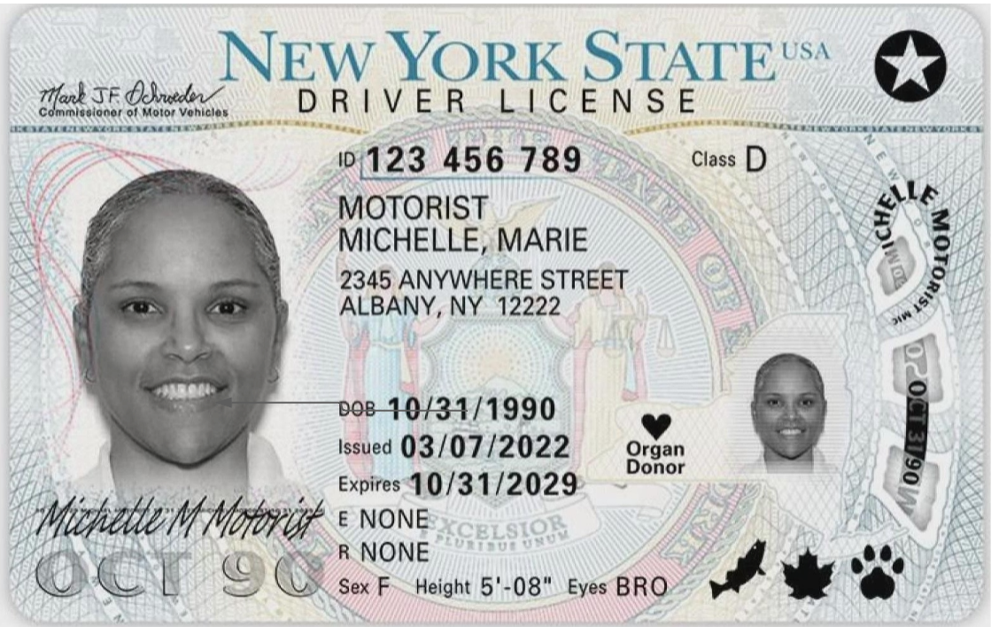
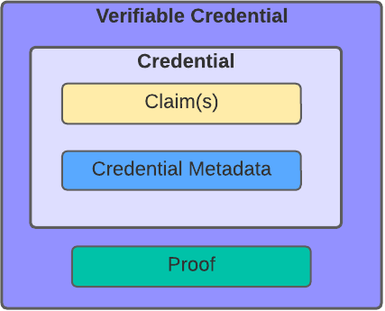
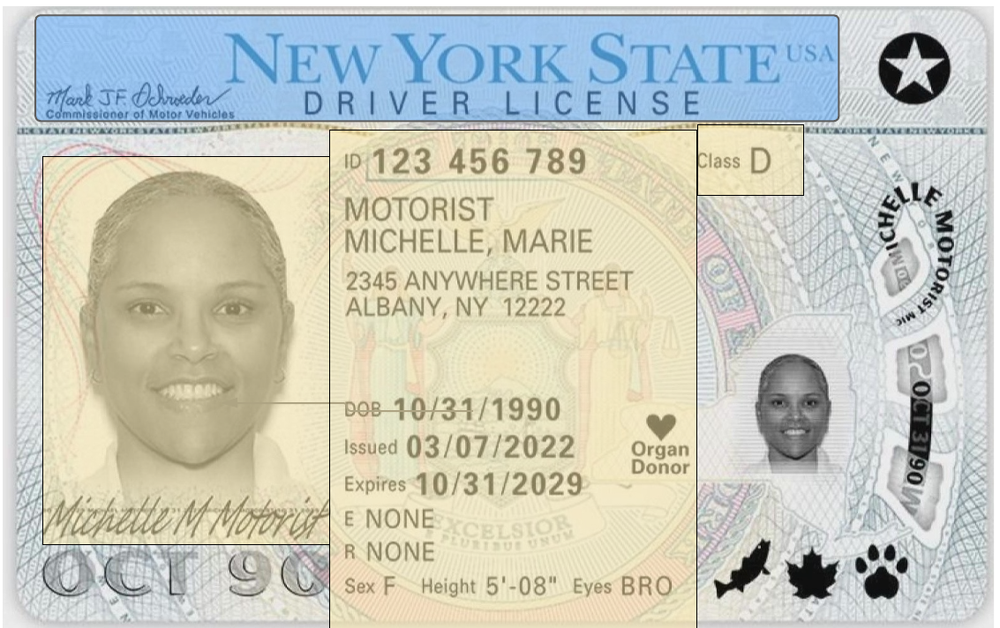
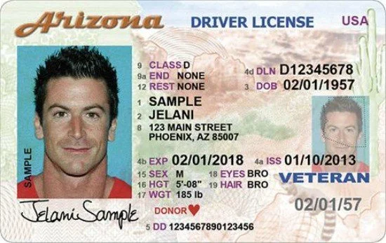

The previous post requires a belated fast-follow for Driver's License VC modeling fans -- all 3 of you.

When I started that post, I intended to use _real_ real-world credential examples. And driver's licenses tend to serve as a universally relatable example; others can get caught up in educational milestones or are locale biased. 

At the same time, when you start digging into how driver's licenses are used and verified, it can quickly get locale-specific -- just see the previous post's endnotes. Further, I resorted to sleight of hand when modeling specific driver's license properties (e.g., expiration date). That's because the technical details, while informative and entertaining for a select few, distracted from the pedagogical goals. As evidence I offer this [collaborative modeling exercise on twitter](https://twitter.com/kimdhamilton/status/1548856618149748736).

## Settle in for a Wild Ride

So let's get into those details now. Starting with 2 reference images...

Michelle's New York State Driver's License:

And a reminder of VC structure:

Question: which fields are VC claims and which are VC metadata? 

## Build up to the Big Reveal

Before seeing "the answer", let's consider why informal, pedagological modeling might look different from the actual VC modeling. Some fields printed on a driver's license appear to match VC metadata properties name-wise: "issued", "ISS", and variants look like the VC metadata property "issuanceDate"; "expires", "EXP", and variants look like the VC metadata property "expirationDate"; "ID" looks like a VC metadata "id".

When introducing VCs, the focus is providing intuition behind the "claim" vs "metadata" distinction -- not beating someone over the head with driver's license minutia. Without going that far, your real-world intuition can come from having the not-too-uncommon experience of losing a physical driver's license or updating your address, needing to request a new one, and thinking about which values would be different on the new one. On general, claims would be the fields with values that are clearly about the person (e.g., address) OR fields whose values are unchanged (e.g., expiration date doesn't change on the re-issued one).

I'll make a best stab for Michelle's New York state driver's license, with a fast caveat that you can't generalize across all states. Notice the utter mayhem in issuance-related properties, and let's hope that this gets cleaned up with upcoming driver's license focused efforts, such as REAL ID, mdl, etc...although, from what I can see, REAL ID may only promote convergence/alignment in minor areas (like setting an upper bound on expiration dates). Baby steps I guess.

## The Unveiling

The yellow-highlighted areas are VC claims and the blue-highlighted are VC metadata. 

## Dispelling your Disbelief

### `expires ` is a claim, not metadata

The VC metadata property `expirationDate` would seem like a natural fit. However, `expires` refers to the lifespan of Michelle's license itself, not any particular instance of a digital VC representing this license.

If we had real VC driver's licenes, you could even imagine a VC metadata `expirationDate` that expires, say, within 1 year, rather than the full lifetime of the claim (4-7 years) -- this is a common digital credential security hygiene pratice.

### `issued` is most likely a claim, not metadata

This is similar to above, but this is where it varies per state and gets complicated. If you start poking around various state license documentation, some seem to imply it's the original date when the state granted you driving privilege for a specific time interval (say 4-7 years, however long your state's licenses are valid), but others describe it as a card "processing date", which sounds more like VC metadata. 

And plot twist: some like Missouri don't even seem to have this field or any variants, per some frustrated TurboTax users.

Next time I run into authors of the [Verifiable Driver's License spec](https://w3c-ccg.github.io/vdl-test-suite) I'll corner them and get you the answers you deserve.

### `ID ` is a claim, not metadata

It seems most states reuse `ID`, not only on reissuance, but also on renewal. 

## Bending the Parallels til they break

### Tamper-evidence and authenticity 

The New York state driver's license has a lot of "security" features, [around 30](https://beta.gothamist.com/news/behold-new-yorks-blah-new-drivers-license?betaRedirect=true) in fact. Some you can see from the flattened photo are:

1. Michelle's first and last name are shown in a swirly pattern on the right hand side, as is her date of birth

2. Her image is on the right hand side embedded in the state of new york

The above could be viewed as helping with tamper-evidence (i.e., if you're modifying a valid DL, it's harder to make it match in multiple locations), but also feasibly helping with authenticity, given that these cards look pretty hard to realistically tamper with anyway. In other words, there are markers that are more apparent in real life such as laser etching, heavy/distinctive materials, etc which serve to more quickly identify a license as authentic. 

### Challenge/Response or proof of control

Michelle's signature is fun. I guess in the olden days you could think of it as sort of a challenge/response; i.e., if your signature doesn't match the one on the card, then you're an imposter. I like viewing this as a proto on-demand challenge/response, but we've lost the fine art of penmanship and this isn't too realistic. I can attest that signature matching is used in Washington state vote-by-mail, but they must have a high tolerance for varationbecause every instance of my signature looks completely different. Let's replace this with DID auth!

## Twitter Reacts

@sgershuni: What if instead of trying to land paper creds onto VC data model, we create new digitally-native credential formats?  E.g. everything except for Class and License # is pulled from other credentials. Composable data and transitive trust all the way

me: This is just an educational/informative exercise and not meant as the ideal mapping, so yes, definitely!

@by_caballero: is this a subtweet, or

me: If so, I guess I’m subtweeting how irritating US drivers licenses are. That will be a recurring theme...

## The World Reacts

@_nat: Does the ID change when reissued or renewed? If so, it is a claim about the identity document and metadata about the person. If not, it is a claim about the person.

me: ID had more going on than I realized — after talking it through with @jvedi we landed on claim

@_nat: Yeah, I thought so. At least, that's how it is in Japan. The passport number is the other way round though. It is metadata for a person and a claim for the I.D. (Identity Document).

^^ I just found this interesting

## New Yorkers Scandalized

The NY Driver's License design we see above appears to be a further evolution, [rolled out in 2022](https://www.lockportjournal.com/news/local_news/redesigned-nys-driver-license-rolled-out/article_08ee98fb-e65d-5e86-b2bd-3364f3cb0b57.html), on a basic structure was rolled out in 2013, to the horror of locals. 

Headlines included:

- [Bendy new york drivers licenses killed by no fun dmv](https://observer.com/2013/08/bendy-new-york-drivers-licenses-killed-by-no-fun-dmv/)
- [Behold New York's Blah New Driver's License](https://beta.gothamist.com/news/behold-new-yorks-blah-new-drivers-license?betaRedirect=true)

Driver's license designs are the target of vitriol you couldn't imagine -- a topic I expect to revisit in the future. For now, make do with this reddit thread titled ["When designers give up: Arizona releases some of the ugliest Driver's Licenses imaginable"](https://www.reddit.com/r/Design/comments/24hbfb/when_designers_give_up_arizona_releases_some_of/), even containing ad hominem attacks on Mr. Jelani Sample, misnaming him "Brah McDouchebag". Say what you will about Mr. Sample, he looks much younger than his 65 years of age and I thank him for his service.

