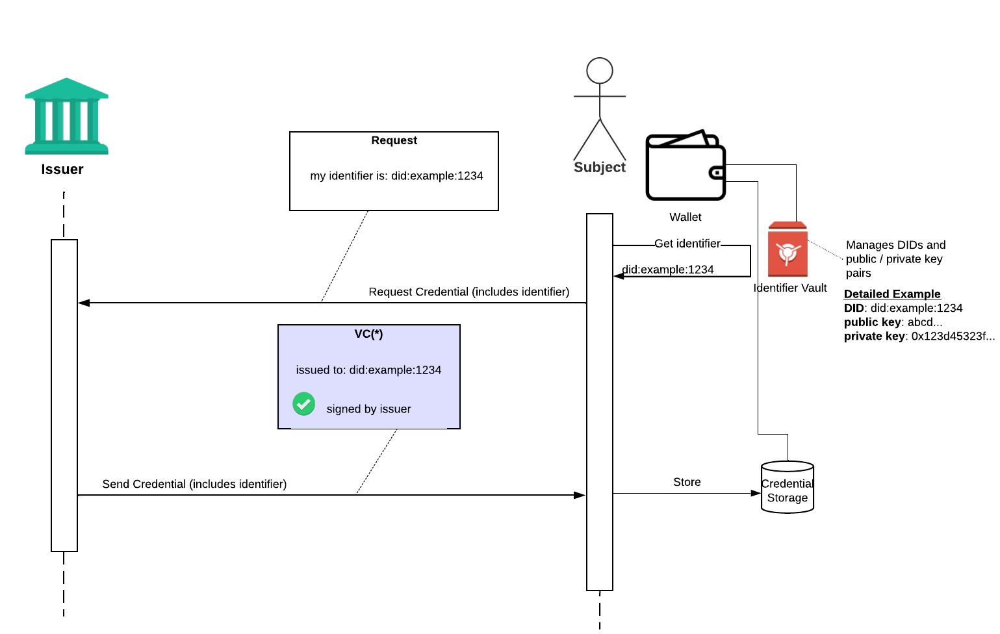
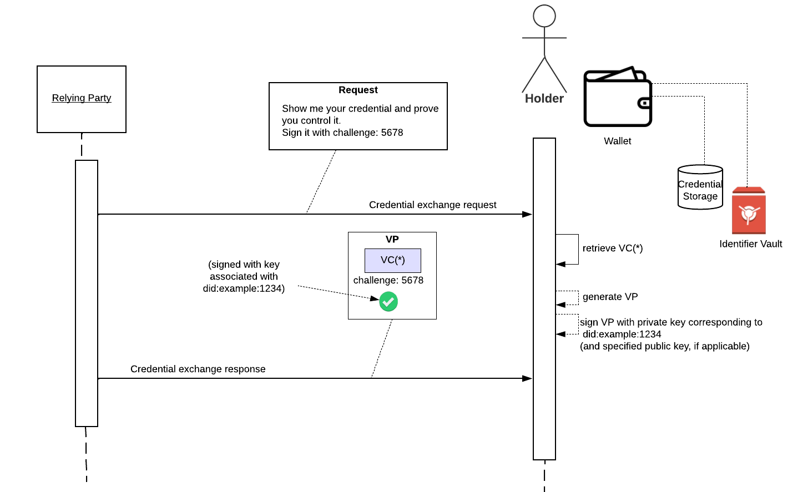

With Decentralized Identity flows, we often use the phrase “proof of control” or “proving control over a credential/identifier". This post provides a visual description of what that means.

A slightly more formal treatment in DIF Presentation Exchange spec ([subject/holder binding > proof of identifier control](https://identity.foundation/presentation-exchange/#proof-of-identifier-control)).

At a high level, it works this way:

- A Verifiable Credential (VC) is issued to a subject (e.g., person), and the subject is identified in the VC by an "identifier" (with the property name `id`).
- The identifier data type is a URI, which is like a web site URL, but can more general. It can be a Decentralized Identifier (DID) in fact
- If that identifier is backed by cryptographic key material (as with DIDs), then you can use standard crpytographic signatures to sign a message proving you control that identifier. 
- At verification time, the credential "holder" can use this property to prove they are the same entity as the credential "subject". They can do this by wrapping a VC in a Verifiable Presentation (VP) and signing the VP with the corresponding private key material.

And this is how a holder proves they are the subject, by demonstrating control of this shared identifier.


## Example

Suppose a VC is issued to a subject with the identifier `did:example:1234`. It would look like this

```json
{
  "@context": [
    "https://www.w3.org/2018/credentials/v1",
    "https://www.w3.org/2018/credentials/examples/v1"
  ],
  "id": "http://example.edu/credentials/3732",
  "type": ["VerifiableCredential", "UniversityDegreeCredential"],
  "issuer": "https://example.edu/issuers/565049",
  "issuanceDate": "2010-01-01T00:00:00Z",
  "credentialSubject": {
    "id": "did:example:1234",
    "degree": {
      "type": "BachelorDegree",
      "name": "Bachelor of Science and Arts"
    }
  }
}
```


## At issuance time….

Before issuing that credential, the issuer would have authenticated the subject in their usual means, and asked the subject to provide a DID that their wallet generated. In this case, the subject's wallet generated `did:example:1234`. The issuer could also asked for proof of control along with the DID at this time (this can be done with an empty VP, with DID auth, etc).

The issuer generates the VC, issued to `credentialSubject.id` = `did:example:1234`, and sends it back to the subject to store in their wallet. Let's call it VC(*)



## At Exchange / Verification Time



Later, a relying party could ask credential holders to prove they are the credential subject.

The subject retrieves the VC they want to share, VC*, generates a VP, and signs the VP with the private key corresponding to `did:example:1234` (or the private key corresponding to a specific public key authorized by `did:example:1234`). The relying party should also include a "challenge" to prevent replays (i.e., this requires the holder to generate a fresh signature).

 This allows the relying party to trust that the original VC hasn’t been tampered with and the subject of the credential is really the intended recipient (possibly with additional levels of identity assurance, as required by the relying party).

## More Details

This post focused on holder and subject binding through proof of identifer control. Read [this section of the DIF Presentation Exchange spec](https://identity.foundation/presentation-exchange/#holder-and-subject-binding) for information about other methods of holder and subject binding, including biometrics
