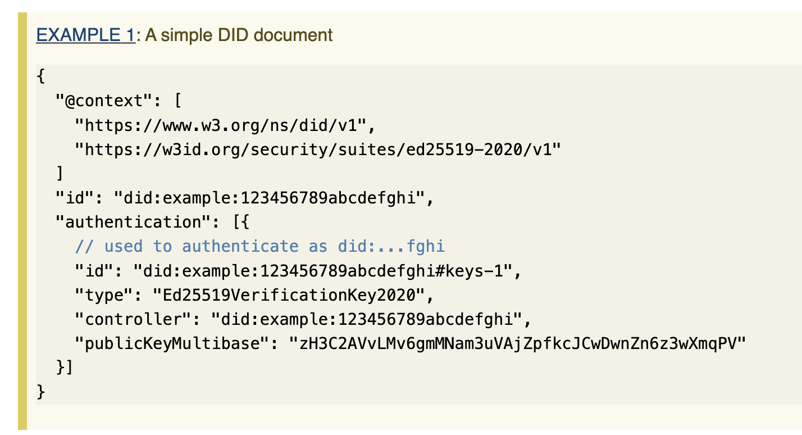

I wrote this up a while ago when trying to explain decentralized identity concepts to newcomers, which included people who would have to soon communicate these concepts to other people. So a large focus was visuals, analogies, etc, as well as common misconceptions. Unfortunately I lost some beautiful formatting in the doc => markdown conversion, but I'll try to recover that later, especially if this content is useful. 

## Foundational Concepts

### Terms and Definitions

These are my working definitions of core terms, designed to balance correctness and simplicity, not pedantry. 

<table>
  <tr>
   <td><strong>Term</strong>
   </td>
   <td><strong>Definition</strong>
   </td>
  </tr>
  <tr>
   <td><strong>Decentralized Identity</strong>
   </td>
   <td>Set of technical standards and principles seeking to enable a shift toward more individual control over digital identities and personal data
    
<ul>
	<li>Also known as: Self-Sovereign Identity</li>
	<li>Common uses: Decentralized Identity Architectures, Approaches, Ecosystems, Solutions, etc</li>
	<li>Source: <a href="https://www.uschamberfoundation.org/sites/default/files/media-uploads/Applying%20SSI%20Principles%20to%20ILRs%20Report.pdf">here</a>
		<ul>
			<li>Note there’s no normative source for this term, so I’m referencing the definition I developed for the US Chamber of Commerce Foundation paper</li>
		</ul>
	</li>  
</ul>
   </td>
  </tr>
  <tr>
   <td><strong>Verifiable Credential (VC)</strong>
   </td>
   <td>Tamper-evident claim made by an issuer about a subject (entity, often a person) whose authorship can be cryptographically verified
 
<ul>
	<li> Common alternatives:  
	<ul>
		<li>"Verifiable Claims": the spec actually used to be called this; change is a result of bikeshedding</li>
		<li>"<em>Verified</em> Credentials": similar enough, but invites a good talking point; see below </li>
	</ul>
	</li>
	<li>Normative Source: <a href="https://www.w3.org/TR/vc-data-model/">https://www.w3.org/TR/vc-data-model/</a></li>
</ul>
   </td>
  </tr>
  <tr>
   <td><strong>Decentralized Identifier (DID)</strong>
   </td>
   <td>An identifier (or label) that enables cryptographically verifiable digital identity. In contrast to typical digital identifiers, DIDs have been designed so that they may be decoupled from centralized authorities or identity providers, and can be entirely under the control of an individual, without needing permission from a third party
	  
	More about it: 
<ul>
 
<li>Think of it as a URL-ish string (technically it is a URI)</li>
 
<li>Looks like <code>did:example:1234</code></li>
 
<li>Can be used to identify (separately) the issuer and the subject of a VC</li>
 
<li>The URI enables resolution of cryptographic keys, ways of interacting securely with an entity (person), etc</li> 
<li>Normative Source: <a href="https://www.w3.org/TR/did-core/">https://www.w3.org/TR/did-core/</a>
</li>
</ul>
   </td>
  </tr>
</table>

### Analogies

Here are (what I hope are) useful analogies for newcomers, or anyone who doesn’t care to get into the technical details. I’ve gone the extra mile and compared/contrasted the analogized entities, thereby beating the analogies into the ground, but hopefully this is helpful for your own mental model.

#### Verifiable Credentials and Envelopes

<small>Figure 1: Postal envelope for mailing a letter. 
Photo credit [Anne Nygård | Unsplash](https://unsplash.com/s/photos/envelope-with-address?utm_source=unsplash&utm_medium=referral&utm_content=creditCopyText)</small>

A Verifiable Credential is like an envelope (used to mail a letter): 

1. It’s a lightweight wrapper around any content
2. It provides functional similarities:
    - "Content integrity":
        - There is an assumption / convention is that the envelope contents don’t get tampered with
        - But to be more precise, if the physical envelope was tampered with, you would be able to detect it. In VCs (and digital signatures) we call this tamper-evidence
        - In VCs this is achieved through the VC proof – if the contents are modified, the cryptographic signature (or other proof mechanism) wouldn’t match.
    - "Authenticity":
        - Looking at the envelope, you know who it’s from, who it’s going to
        - In VCs, this is enabled through VC issuer and credentialSubject properties 
3. We’ve all steamed open envelopes as a child and therefore know the failure modes. Graphically, you might use a Game of Thrones-looking envelope with a wax seal / sigil (see Figure 2) to make it look *really secure* but … 
4. The analogy breaks down pretty quickly, because:
    - In contrast to physical envelopes, VCs are secured by cryptography – not the act of licking
    - A physical envelope hides its contents (letter), but a VC is not hidden or even necessarily encrypted. VCs provide digital signatures, which is the "content integrity" part described above.

<small>Figure 2: Envelope with a wax seal. Photo credit [Svetlozar Hristov | iStock](https://www.istockphoto.com/portfolio/SvetlozarHristov?mediatype=photography)</small>

#### Decentralized Identifiers (DIDs) and…

##### DIDs and Web URLs

DIDs are strings that look like this:

    did:example:1234

Notice that it looks like a web URL, and actually they are related. Both are types of URIs ([Uniform Resource Identifiers](https://en.wikipedia.org/wiki/Uniform_Resource_Identifier)). Just as a web browser can take a web URL and render a web page, software that understands a DID can retrieve its associated "DID Document".

Or visually, just as `https://twitter.com/` resolves to a twitter web page:

`did:example:1234` resolves to a DID document:

##### DIDs vs Social Security Numbers (SSNs)

* This analogy tends to be helpful as a contrast, or punching bag, because in the US we know how SSNs can easily be compromised and used for identity theft
* Specifically, it’s shockingly easy for someone to learn your SSN plus a few other tidbits about you, and start hijacking your identity. So instead, we say "imagine it’s a SSN but you (and only you) can use it because you can prove it’s yours"
* The DID/SSN contrast is further helpful when talking to the relative advantages of DIDs because:
    * SSNs are used in a loose way; attributes are associated with them whether the person associated with the SSN is involved or not.
    * In contrast, DIDs are expected to be used in protocols where proof of control is required, so a loose claim assigned to a DID is less valuable to a RP
* Some other notable distinctions:
    * Whereas you have 1 SSN, people are expected to have lots of DIDs for different purposes. Wallets/software help people manage them
    * In contrast to SSNs, people should never be expected to remember their DIDs 
    * SSNs are a government-issued identifier whereas DIDs may be self-issued/created. DIDs _could_ be bestowed upon you, but even in this case you’d likely (because they’re not very interesting otherwise) be able to tie them to you through authentication or some means.
        * Note that DIDs are being considered as a data type for some national digital ID systems
    * Whereas an SSN is a flat string, but a DID "resolves" to a DID document which contains data like public keys, services, etc, as shown in Figure 3

##### DIDs vs Cryptographic Keys (or addresses, like a cryptocurrency address)

One oversimplified shorthand is to think of DIDs as cryptographic keys with built in lifecycle, like you can rotate keys. Because the DID string resolves to a DID document, you can update the document over time.

## Pitfalls and Misconceptions

### Myths and Facts

<table>
  <tr>
   <td><strong>Myth or Misconception</strong>
   </td>
   <td><strong>Fact</strong>
   </td>
  </tr>
  <tr>
   <td colspan="2" >Correctness of VCs
   </td>
  </tr>
  <tr>
   <td>A VC must be logically true or factually correct
   </td>
   <td>A VC simply contains assertions (statements) made by an issuer. An issuer can assert a claim that is subjective, flawed, or demonstrably false. And certainly, the claim within a VC is not intended to be provably correct based on formal logical methods. 
  
The issuer of a VC can be anyone and they can say whatever they want. It’s up to verifiers or relying parties to decide whom and what they trust.
  
Example: In 2016 we briefly discussed using VCs to help address discovery of reliable sources of news information and, while it could offer some benefits here and there, without massive effort it would likely just reinforce existing echo chambers
   </td>
  </tr>
  <tr>
   <td colspan="2" >Where personal data lives
   </td>
  </tr>
  <tr>
   <td>Personal data is on-chain
   </td>
   <td>Early decentralized id solutions did put personal data (or hashes of it) on-chain but most have moved away from this architecture.
  
As of the last couple of years, on-chain items are typically restricted to, at most:
<ol>
	<li>DID "anchors" (something that enables DID discoverability and resolution), or</li>
	<li>Registries, such as credential status or revocation registries</li>
	<ul>
		<li>Although status registries should also avoid containing personal data </li>
		<li>Typically they are inclusion proofs or similar data-minimizing mechanism</li>
	</ul>
</ol>
Why data has mostly moved off-chain
<ul>
	<li>Largely not needed, cryptographic signatures generally suffice for the tamper-evidence aspects. The problem is reliably mapping crypto keys to entities. And that’s why DIDs are sometimes anchored to blockchains</li>
	<li>Runs in violation of frameworks such as GDPR including write to erasure. Deletion runs counter to the goals of anything but a degenerate blockchain. </li>
 	<li>Anticipating your rebuttals, see the next 2 entries</li> 
</ul>
   </td>
  </tr>
  <tr>
   <td colspan="2" >But what if it’s encrypted?
   </td>
  </tr>
  <tr>
   <td>If the data is encrypted, it’s ok to put it on-chain
   </td>
   <td>No, we want to avoid this too. As you probably know, the encryption algorithms you use over time have changed for a combination of reasons including stronger processing power and exploits found. 
  
We also worry about the impact of quantum computing, enabling at some point, all of this to be effectively clear text on a blockchain. 
  
Stop trying to put unnecessary data on a blockchain. It’s a super wasteful way to store data anyway. 
   </td>
  </tr>
  <tr>
   <td colspan="2" >Privacy, correlation, and hashes of personal data
   </td>
  </tr>
  <tr>
   <td>Hashing credentials (or performing some similar 1-way function) containing personal data before putting it on chain makes it ok
   </td>
   <td>Even the result of 1-way functions, when combined with the permanence of blockchains, may result in privacy concerns – particularly, the ability for other parties to perform correlation. In fact, frameworks like GDPR also call out concerns around correlatable data, including that generated by hashed data.
  
The specific threats can take a while to describe (a topic for later), but in general, you want to make it hard for an attacker (or lurker) to learn additional information about a person over time through repeated use of digital fingerprints traceable to the same entity. This is similar to how reuse of crypto addresses enables correlating one’s behavior, and sometimes doxxing, over time. Chainalysis and similar tools make it easy to discover a large amount of additional user information based on address reuse, flow, and transaction history. Now imagine if you add identity data into the mix – a la Celsius.
   </td>
  </tr>
  <tr>
   <td colspan="2" >Use of DIDs in VCs
   </td>
  </tr>
  <tr>
   <td>VCs require use of DIDs
   </td>
   <td>VCs identify issuers and subjects with URIs, so it can be a web site, etc.
  
It can also be a DID, but it doesn’t have to be.
   </td>
  </tr>
  <tr>
   <td colspan="2" >Number of DIDs
   </td>
  </tr>
  <tr>
   <td>A person will have 1 DID
   </td>
   <td>A person will likely have many DIDs, and ideally most of these are under their control (self-custodied, meaning they own corresponding private keys or proof)
  
Exact patterns are still emerging:
<ul>
	<li>it’s possible people will prefer a DID for every credential (wallets / software manages it for you)</li>
	<li>It’s also possible people will have vanity DIDs or specific DIDs they want to attach "public" claims to (think of this like stuff you’re comfortable putting on LinkedIn)</li>
</ul>
   </td>
  </tr>
  <tr>
   <td colspan="2" >"Credential" vs security credential
   </td>
  </tr>
  <tr>
   <td>"Credential" refers to security access credentials, like login usernames and passwords, etc
   </td>
   <td>In the context of "Verifiable Credential" it means what we've discussed above. [More details are here](https://www.okimsrazor.com/verifiable_credentials/). Just stating this for your awareness; this perception is commonly for people working in identity and access management.
   </td>
  </tr>
  <tr>
   <td colspan="2" >What is a credential "subject"
   </td>
  </tr>
  <tr>
   <td>"Subject" refers to a topic, school subject, etc
   </td>
   <td>In the context of verifiable credentials it’s the entity (commonly a human) that the claim/statement is made about.
   </td>
  </tr>
  <tr>
   <td colspan="2" >Who can issue VCs
   </td>
  </tr>
  <tr>
   <td>Only traditional "authorities" (educational institutions, governments, etc) can issue VCs
   </td>
   <td>Anyone can issue a VC, ranging from traditional authorities to, well, you, your friends, peers, etc. Non-person entities can issue them as well.
     
As covered previously, this doesn’t mean relying parties have to accept a VC issued by your brother claiming that you can drive. It’s up to relying parties or verifiers to decide whom to trust. They may accomplish this through trust registries or other signals of reputation.
   </td>
  </tr>
</table>

### Other uncomfortable conversations

<table>
  <tr>
   <td><strong>In brief</strong>
   </td>
   <td><strong>Long story</strong>
   </td>
  </tr>
  <tr>
   <td colspan="2" >"Self-Sovereign Identity (SSI)" vs "Decentralized Identity"
   </td>
  </tr>
  <tr>
   <td>These are kind of synonyms but be aware that, depending on who you’re talking to, SSI may be off-putting
   </td>
   <td>
<ul>
	<li>Negative reactions to the word "sovereign"
	<ul>
		<li>In some regions of the world, it can sound like it’s pushing an agenda for rugged individualism</li>
		<li>Some people think it’s referring to an extremist movement <a href="https://en.wikipedia.org/wiki/Sovereign_citizen_movement">like this</a>. (Although <a href="https://twitter.com/kimdhamilton/status/1296222904766496768?s=20&t=ith9zuZZWw5pez5k-JHRZw">at times I feared it was</a>)
		</li>  
	</ul></li>
	<li>But <a href="https://decentralized-id.com/government/europe/eSSIF/">Europeans seem to dig it</a>. Who knows 🤷🏼‍♀️</li> 
	<li>Christopher Allen’s <a href="http://www.lifewithalacrity.com/2016/04/the-path-to-self-soverereign-identity.html">Path to Self-Sovereign Identity</a>, released in 2016, remains the most commonly referenced set of SSI Principles. Despite his efforts to drive a community-led revision (I can’t find the link to the github issue), they’ve not yet been updated. He was trying to address concerns like the following:  
	<ul>
		<li>Concerns that it reads "techno-utopian", i.e., over-reliant on avoiding access to personal data. Specifically, this has been named by regulators as a source of friction because there are many cases where data must be retained by regulated entities, shared among entities, and so on.</li>
		<li>This is, of course, a misunderstanding, but needs to be clarified. Since then, there’s growing consensus that a better framework enabling nuanced privacy considerations is <a href="https://en.wikipedia.org/wiki/Contextual_integrity">Helen Nissenbaum’s conceptual integrity</a>, in which privacy is provided by context and associated norms related to parameters (sender, subject, recipient, type of information, transmission principle).</li>
		<li>I’d say that the remaining missing factor, if you want to think of decentralized identity or SSI as enabling the internet’s missing identity layer, is this: we tend to think about decentralized identity as bringing order to the chaotic flow of our personal data. But in my mind, a significant value add is enabling bidirectional identity assurance (authentication). This is truly an advantage over the current state in which we are constantly proving who we are to the companies we interact with, but we get little assurance in return – resulting in threats resulting from asymmetric information, such as phishing attacks.</li>
	</ul></li> 
</ul>
   </td>
  </tr>
  <tr>
   <td colspan="2" >"<em>Verified</em> Credentials": note <em>verified</em> not verifiable
   </td>
  </tr>
  <tr>
   <td>This is a generally acceptable synonym and you should give the benefit of the doubt.
  
It could be a good talking point, making this an uncomfortable conversation not for you, but probably for your interlocutor who really doesn’t care.
   </td>
   <td>In contrast to traditional credentials where the exchange may be between 2 trusted parties (e.g., two financial insts communicating directly with each other via secure means), VCs are meant to be <em>re-verified</em> (within reason) on every use because the issuer can update the lifecycle (revoke it, etc).  
  
Within reason means that, depending on the type of credential, there are realistic simplifications you might make about credential update frequency. E.g., the OFAC SDN list is only updated / published 1x day so in a case where you know that’s the only factor influencing the validity, you wouldn’t need to recheck every minute (just for example)
  
That means a VC is not in a <strong><em>permanently verified</em></strong> state, but it should be verified when used. It is <strong>verifiable</strong>, not verified.
   </td>
  </tr>
</table>

