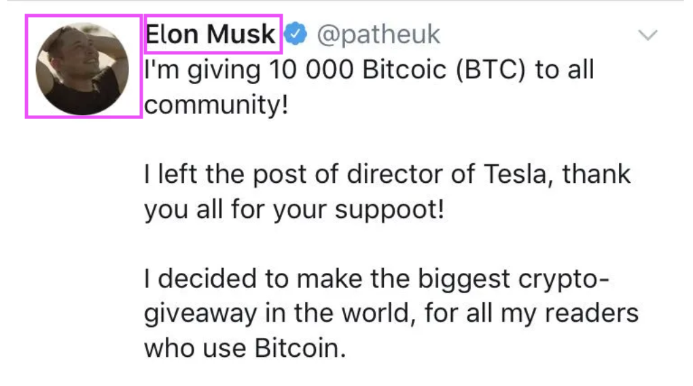
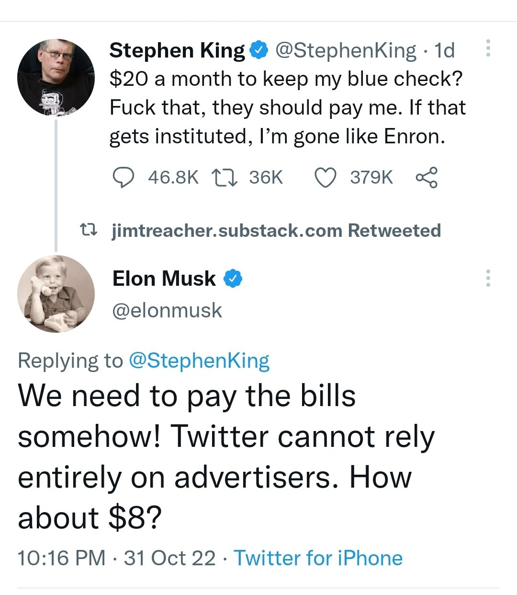
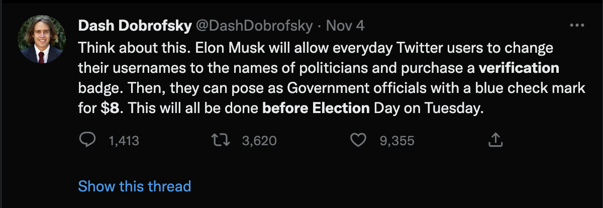
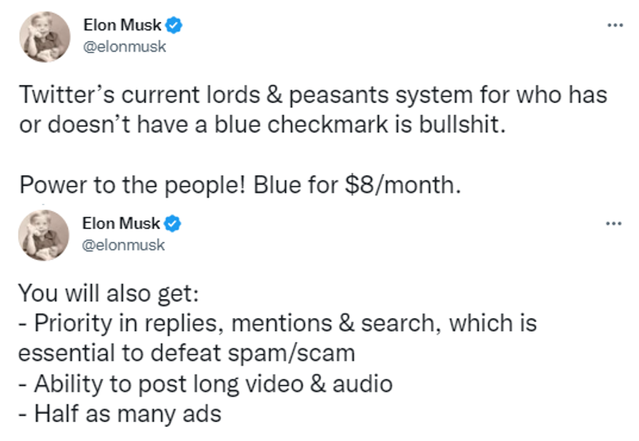
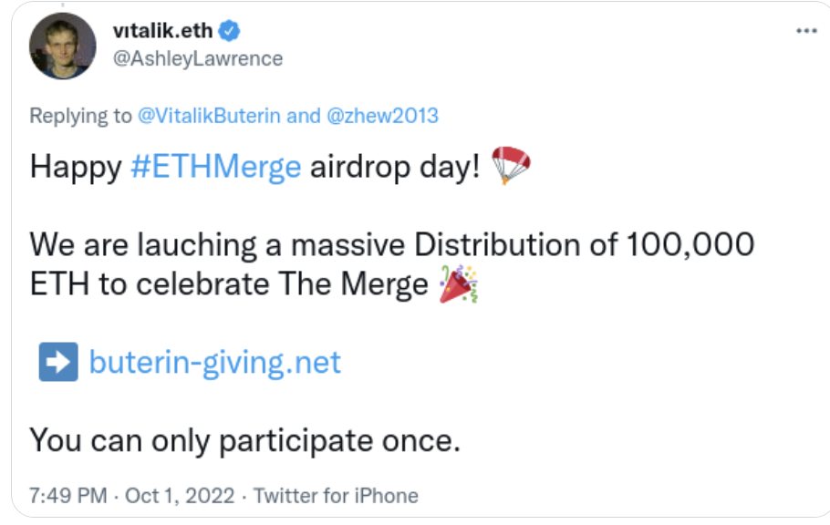
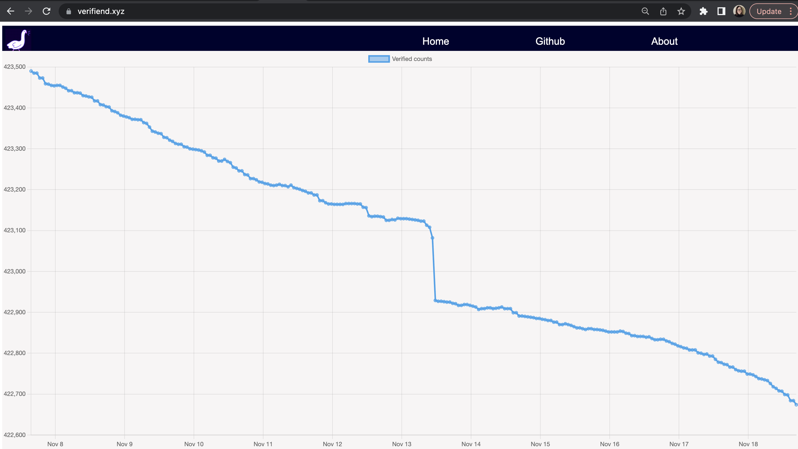
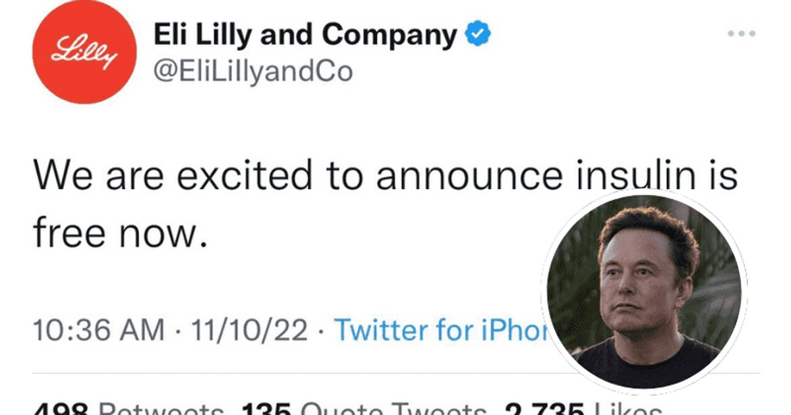

> Update: things are moving even faster than described below, Twitter-wise, and it's possible this may function as a swan song. Either way, Twitter has taught us a lot about reputation and identity in a very short amount of time, and we will take these lessons with us.

Identity and reputation systems are hard. This is becoming increasingly clear...or shall we say, _sinking in_... for users of the social media network Twitter. Under new management, changes to Twitter's traditional verification process have been explored in real time.

First, some clarfications. By "traditional Twitter verification process" I'm referring broadly to the method used before November 2022, resulting in a blue "verified" checkmark. The details and requirements of this process are known to Twitter alone, but we do know it strived for "real" identity verification, meaning the identity information (name, photo) claimed in the Twitter profile belongs to the expected individual.

In particular, it attempted to prevent the following from occurring: a "verified" checkmark on a profile _appearing_ to be a famous individual but actually corresponding to an imposter trying to scam people.

### Twitter Verification -- the "before" state, the proposal, and initial reaction

But that's jumping ahead. Until early November 2022, this blue checkmark more or less minimized such abuses, and functioned as a visual indicator distinguishing notable "public figures" from imposter accounts.

To be clear, there are valid criticisms of the traditional process: the opacity (no one knew exactly what was required to get it), the fact that a single company has the power to bestow or remove the "verified" marker on a whim. But at least it felt stable and therefore the idea of abrupt changes to this process, including switching to a ~~$20~~ $8 fee, was met with resistance.

Fundamental concerns were raised, resulting from dependencies on the traditional verification process. Twitter has functioned as a global town square over the last decade, enabling rapid spread of information and misinformation and has been considered to play a role in the outcome of significant world events. So a sudden rollout of dramatic changes to a fundemental feature like identity -- especially given Twitter's scale -- was alarming to many.

Journalists expressed concern that the proposed changes could make it difficult for users to distinguish misinformation from fact-checked content from a trusted news organization (as determined by the user). Rolling out such changes immediately before an election further increased anxiety.

Even more confusing, the rationale, timing, logistics, and semantics of the changes were not clear. I'm not sure we were all on the same page about:

1. Why is the change occuring? Is it to increase revenue? To make the process more democratic? (Per Elon's "power to the people" tweet below) Both?
2. Would existing "verified" users lose their marker if they don't pay the fee? And what is the
3. Semantics -- what is the difference between "verified" vs "official"?

Let's put that aside for now because it's not critical to the rest of the discussion.

UPDATE: I only recently stumbled on this. If you want to know more about my questions above, please read what Yoel Roth, _former_ head of trust and safety at Twitter [wrote about it](https://twitter.com/yoyoel/status/1589804641361231872?s=46&t=4MQJqvrXw9n-7bzsXgyc2w).

### Why is the "identerati" interested in this?

Real-time experimentation on Twitter verification has an additional draw for me and others interested in decentralized identity. In decentralized networks, including social networks like Bluesky, reputation is an even harder problem than in centralized alternatives like Twiter -- this is by design. We are interested in building solutions where it's not possible for any one company (like Twitter) or organization to target or censor individuals on a whim, thereby limiting access and rights of individuals. We're interested in building alternative ways to establish reputation and trustworthiness.

At the same time, we also want to prevent abuse by those looking to game the system. The potential risks depend on the type of system, but the following are representative examples:

* For social media networks: a user poses as someone else to achieve a platform to spread misinformation or to trick people into scams Users like Vitalik Buterin are a common target, as in the screenshot below.
* For decentralized digital currencies: spinning up multiple identities to circumvent security controls and perform "double-spends" -- spending the same funds twice, effectively stealing from one of the recipients.

There are many methods used (alone or in combination) to prevent or reduce these risks, but two of those are precisely the "before" and "after" Twitter verification methods -- i.e., real identity verification (before) and fee-based models (after).

Real identity verification of course gives you high assurance of who your users are, but it's costly, time-consuming, and not necessarily needed or wanted in all cases.

The idea behind a fee-based approach is to make fraud cost-prohibitive to scammers. However, these solutions are never simple. With a fee-based approach, for example, it's hard to find a solution that makes it expensive enough to prevent fraud yet not too expensive that other users are deterred. And any solution (including requiring specific identity documents) may introduce new barriers that exclude populations unintentionally.

Imagine if you had to pay money to send email. That sounds annoying, but if, in return, it reduced the amount of junk email you got, would that be more appealing? The idea here is that, if you had to pay a small amount of money per email, you wouldn't entirely be deterred from using email, but it would be too costly for users that want to send bulk marketing emails.

Paid email was just a thought exercise; we enjoy free email and rely on other methods (email filters that look for suspicious words) to avoid swimming in junk email. But that's representative of the tradeoffs we make in system design. We identify risks, we think of mitigations, and consider potential harms introduced along the way, including intended or unintended consequences. An example of an unintended consequence is if a fee turned out to be too high and resulted in excluding a cset of users.

### So how can I help?

All of this is to say that these problems have no easy answers and therefore any lessons learned from Twitter's rollout stands to benefit decentralized identity systems, Forther, I innocently thought this might be a good opportunity to maybe even help if unintended consequences occurred.

For example, if you were verified as of November 10, but then unexpectedly lost that status on November 11, how would you prove that? These are exactly the sorts of problems we try to address with decentralized identity solutions. Instead of your identity claims being locked into companies, we want to enable you to carry it with you in the form of a portable "Verifiable Credential" (VC) that you carry in your own digital wallet.

The number of verified users is small -- roughly 420,000 currently. And it's not clear a "formerly verified" portable credential would even have any use. But this had several unique advantages as a motivating use case:

1. The relatively small amount of data  meant it was actually achievable with Twitter's API rate limits
2. The timeliness and general interest around "what would happen next" meant that being able to visualize trends and inspect the data would be interesting. Do the numbers dramatically increase? Are certain types of users receiving preferable treatment?

So I picked this as a timely motivational example to show how portable VCs could be "bootstrapped" from a centralized authority. Even if "Twitter verified" isn't the most interesting use case, this method could be applied to other, more valuable types of attestations.

### Enter Verifiend

VeriFIEND is the the verified account verifier. It's part one of this open source experiment. It collects complete lists of Twitter verified accounts as often as it can (given Twitter's API rate limits). These dumps will help it serve as a witness, enabling part 2 -- VeriFRIEND.

#### What's happening so far

The first priority was reliably injesting verified user lists. The quickest method seemed to be dumping the complete set of users the Twitter "@verified" account ([https://www.twitter.com/verified](https://www.twitter.com/verified)) follows. But Twitter's API rate limits drag this out -- it takes about 8 hours to get a complete snapshot of the current list of verified users.

So every \~8 hours I'm getting a complete dump of verified users as of the start of that query and archiving them in S3. When the next 8 hour cycle completes, I can determine "diffs" between snapshots -- who was added and who was removed as verified users.

There is also a quick way to get just the raw following count without going through the full 8 hour cycle, so I'm grabbing those every hour to fill out the picture.

Based on this data, we can view trends in verified user counts over time. The [Verifiend dashboard](https://verifiend.xyz/) shows these counts over the past week and a half (and counting).

The full details and assumptions behind this collection are described in the [Verifiend technical README](https://github.com/kimdhamilton/verifiend/blob/main/README.md). You can also see the [backend source code here](https://github.com/kimdhamilton/verifiend).

### Roadmap and Rollout

There's more going on behind the scenes I haven't rolled out yet. One thing that may not be clear: the count is clearly declining, but some additions are being made. So at almost all data points, the number of de-verified users exceeds the net decline shown in the chart. I have this data, as well as the lists of which users are being added and removed, but am not yet displaying it.

Here is the roadmap from an end-user-facing perspective:

* \[DONE\] Verified counts over time displayed in Verifiend dashboard
* \[IN PROGRESS\] Dashboard improvements
  * Overlay above datapoints with +/- counts
  * Rollups/aggregates for better responsiveness
* Exports of raw verified data (as opposed ot just counts).
  * This would enable, for example, drilling in to see which accounts are becoming unverified
  * There are privacy concerns with this, discussed below
* Verifriend! The angel to Veri-fiend's devil
  * This is the decentralized identity part, where users can get portable VCs stored in their digital wallet

I make no guarantees on timing; this is my weekend / fun project. There are assumptions, nuances, and concerns I want to cover, but before we get to that, let's catch everyone up to present. Verified collection service running stably, I checked back in on the rollout of the new $8 fee model.

### Checking in on Twitter

Twitter users gladly forked over $8 and in return treated the world to novel and creative applications of their newly acquired mark of prestige.

Some of these took the form of obvious parody, perhaps requiring close scrutiny and double-takes because of the verified checkmarks, such as in [this exchange between "Ben Shapiro" and "Ted Cruz"](https://twitter.com/AttemptXX4/status/1591094667353128960).

Others impacted markets, as in this example where a [mock Eli Lilly account announced free insulin](https://twitter.com/paulkidd/status/1591156461656498176). While embraced by those with utopian instincts, investors revolted at the idea and dumped the stock.

Ultimately twitter had to suspend this rollout, as advertisers revolted en masse at the outcomes like above. Twitter will now be rolling out the ROCK SOLID version November 29.

But it's really hard to say. With a relatively small percent of remaining employees, I'd be surprised if they have time to work on new features on top of learning to support new feature areas. But if they find that mythical 7500x engineer, just maybe...

It's a tale best viewed in storybook form, enabled by [this thread](https://twitter.com/christapeterso/status/1592317592966168576?s=20&t=naanLJ4U6T8GO_Q4xbxXqQ).

### On to Verifriend

Veri-FRIEND is the dual of the obnoxious goose-led project Verifiend, which will help bootstrap decentralized identity claim techniques via portable VCs controlled by users themselves (instead of a centralizd service).

#### Trust model

In general, the trust model of what I'm proposing works like this: if someone trusts that I have written software to collect data for this purpose and that my software will issue a VC if and only if the collected data indicates you were in a specific set of (verified, in this case) users at a given point in time, AND if they find this information useful, then they can choose to accept this credential. That's a stretch, but hey, this is just an experiment and the cost is nothing to you except for the time you're wasting reading this..

### Other concerns

#### Why are the counts dropping

Looking through the de-verified accounts, many are now blocked or banned from Twitter. In these cases, I can't see what activity may have been happening leading up to de-verification. However, some de-verified accounts remain. I anecdotally poked around to see why these accounts might have lost their status (e.g., did they post something offensive to new management?). It really was not clear why they were being dropped. So more digging needs to be done.

#### Limitations and assumptions

It is not clear the answers are in my data sets. I keep mentioning API rate limitations. This is a technique Twitter uses to prevent average users extracting value from Twitter's data. I can collect at most a small fraction of the overall activity, and anecdotal analysis like I'm doing can introduce bias (or cherry-picking results). Yet rate limits prevent me from getting a meaningful amount of associated data to avoid that.

Other limitations and assumptions:

* No data pre-dating Elon, so it is not clear if these metrics are atypical historically
* It is not clear how new $8 verified would be queryable through APIs
* In determining added/dropped verified users, I'm using "id", which I'm assuming to be stable

#### Sharing the details, responsibly

So I would like to open up these data sets, just in case they're valuable to someone. But I want to do this in a way that doesn't compromise privacy, for example in the case that a Twitter user doesn't want others to know they are no longer verified.

Options include:

1. Opening up to researchers upon request with very clear usage guidelines
2. (*) Because this information is public domain, another option is to share this data by default but give people the right to delete upon request.

Researchers I've talked to indicate #2 makes sense in this specific case. I also considered approaches involving anonymization, but it's not clear that would result in a valuable data set (given all of the concerns mentioned above.)