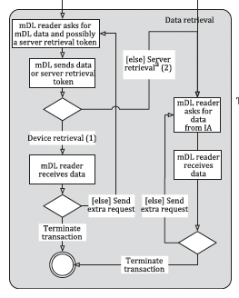
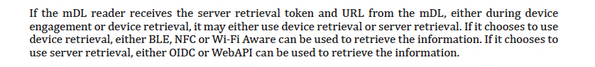
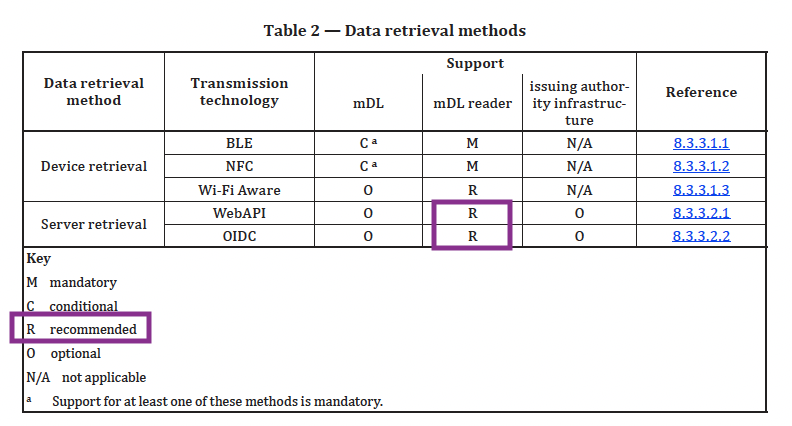
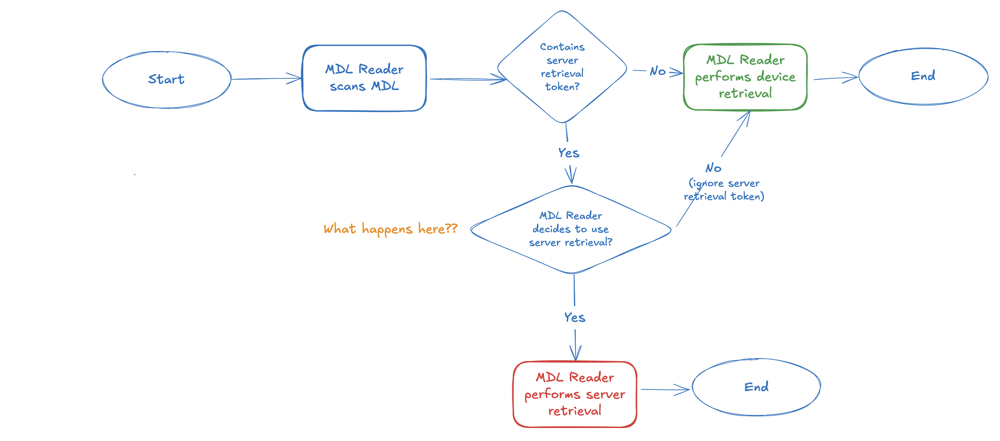

*Part 2 of a series on Mobile Driver's License privacy. See [part 1](../latent_surveillance)*

We've been told that the “phone home” server retrieval feature is optional, that no one really implements it, and so we're done, right? Unfortunately not yet. The stakes are high. We're talking about critical digital identity infrastructure, so let's dig in.

Let's also be generous and skip the question of why leave a feature no one uses in a specification. (Even though unused features could present a security risk and should be removed promptly if unnecessary.)

**Can't We Just Not Use Server Retrieval?**

In his IIW sessions, Steve McCown posed this question: can't we just not use server retrieval? Leave it in the spec but never use it?

The conclusion from those IIW sessions—which I'll correct subsequently—was that mDL readers were required to implement server retrieval mode. Even implementers and spec contributors (in that session and afterward) were under the impression that a server retrieval “instruction” is mandatory; i.e., if the mDL reader receives the server retrieval token in the mDL data, then they must perform server retrieval. 

The reason for this conclusion was this diagram from the ISO specification showing the mDL transaction flow. 

But that conclusion wasn't right; we need to supplement the above diagram with other parts of the spec.

## **Let's Dig In**

Because I'd heard assurances from implementers that SR is essentially unused, the IIW confusion suggested I needed the authoritative source. So I forked over $300 USD to get the actual ISO specification and settle this definitively. It did, and it introduced new questions.

### What the Specification Actually Says

Indeed ISO 18013-5 says that server retrieval is optional. Let's look at two areas. 

Section 6.3.2.1 says "If the mDL reader receives the server retrieval token and URL from the mDL, either during device engagement or device retrieval, it ***may either use*** device retrieval or server retrieval."

This implies that the mDL reader can effectively ignore the server retrieval token and use device retrieval. That's good for our immediate question, in that an mDL reader can just not implement server retrieval. 

Next we have this table, which clearly shows it's not **required** for mDL readers. It's also not optional, but **recommended**. 

### The mDL Reader Does What?

Those assurances from the spec brought up more questions:

1. The mDL reader can ***ignore*** a server retrieval token and just use device retrieval? What would an issuer think about that? Would they find another mDL reader that will obey its instructions? Are these even the right questions?  
2. What is the mDL reader's decision making process? Is this covered by the spec?  
3. How do mDL reader implementers interpret “recommended”?

The idea that the mDL reader has a decision making role here was baffling. To make it crystal clear, here's the full flow:

I don't have an answer for the “What happens here??” diamond, and how an mDL reader decides, upon receipt of a server retrieval token, whether to perform server retrieval or device retrieval. There are no details about that in the spec.

So how do you, as an individual mDL holder, know what choice it will make? We have to look at what implementers are actually building. But first, let me address the claims I keep hearing about server retrieval being unused.

## **The Reality Check**

*I won't link to these sources because my goal is not to shame, just to promote clarity. If you need sources for correctness or investigative reasons, please reach out and let me know*

Implementers and contributors to mDL have been telling us that server retrieval is not a problem—that it's rarely implemented and shouldn't be a concern. Since the spec isn't publicly available and implementation details are opaque to users, we genuinely need their expertise to understand what's actually happening in practice.

When these questions are raised, we are overwhelmed with responses like: "you cite server retrieval from 18013-5, an optional feature of the standard rarely implemented...Details matter here and your criticism's[SIC] of ISO 18013 as a whole continually lacks this" and "And what alternative do you propose? (That does not involve your personal commercial interests?)"

These are pretty spicy, but **what's needed is detailed explanations.** If server retrieval really is rarely implemented, help us understand: under what conditions do readers implement it? How do they decide when to use it? What should users expect?

The only other resource we have at our disposal is public github implementations, to see what is actually being built. In my quick search, I found **at least 7 different public implementations that include server retrieval**. 

What's happening here? My guess is that they are likely incentivized to implement it, in case not doing so excludes their solution from procurement.

**The problem with ambiguous specifications is that implementers may err on the side of completeness.** When in doubt, they build everything the spec mentions rather than risk non-compliance later. After all, the spec said it's recommended.

And remember, all of this is completely opaque to users.

## **The Real Issue: Two Critical Implementation Questions**

The server retrieval problem boils down to two key implementation decisions:

1. **Will the issuer use it?** Will they include server retrieval tokens in credentials?  
2. **Will the reader implement it?** Will reader software be capable of server retrieval?

Here's what we know:

**For issuers:** It's optional whether to use server retrieval tokens at all. If they use it, they also choose whether to include them in individual credentials. 

**For readers:** The spec says it's "recommended" to implement server retrieval capability. And as my quick GitHub search revealed, readers are implementing it.

Prohibiting issuers from using it at all is clearly an option, and it's a great start.

But if mDL readers have implemented server retrieval capability, we're left with latent surveillance infrastructure. We're just one policy change away from that trap door.

## **The Implications**

This ambiguity has already created problems. Vendors are confused. Companies building mDL systems are making different choices based on their interpretation of unclear requirements.

There is some hope on the horizon. Organizations like AAMVA have recognized these concerns and decided to prohibit _issuer_ use of server retrieval in their guidelines. But this highlights a fundamental problem: we're building surveillance infrastructure first and hoping policy will protect us later. That's backwards.

Individual policy fixes aren't enough when readers are still implementing server retrieval capabilities, creating trap doors for surveillance that could be activated with a simple policy change. This approach is particularly troubling because server retrieval is just one of many broader linkability problems with mDL (and other digital identity systems, to be clear).

Since implementers claim no one uses server retrieval anyway, the solution is clear: remove it entirely from the specification and address the remaining privacy issues.

*Next: In Part 3, we'll describe alternatives, touch on remaining linkability challenges, and discuss concrete steps.*
